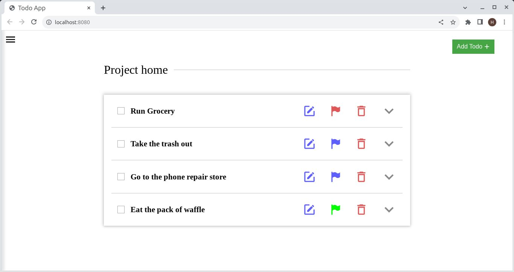
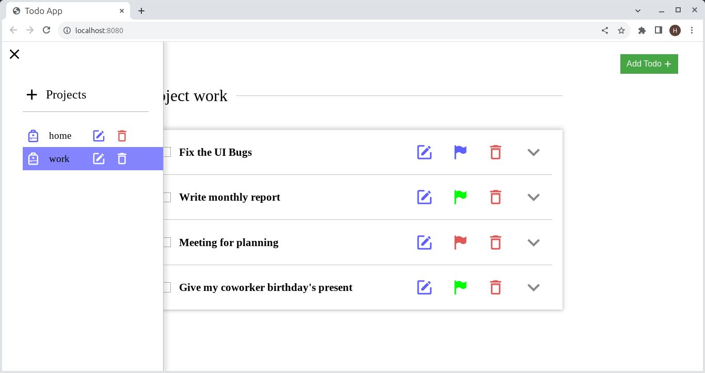

# Todo-App

Todo-App is a todo-list web app with a simple interface. It has the functionality for adding, renaming and removing projects, with each project contain its own todos. You can also add, remove and edit the details of each todo. 

